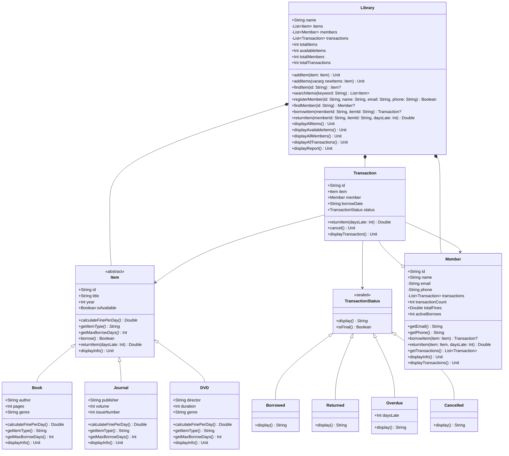

# LAPORAN TUGAS MANDIRI PEMROGRAMAN BERORIENTASI OBJEK
## Sistem Manajemen Perpustakaan Digital Berbasis Kotlin

---

### Identitas Mahasiswa
- **Nama** : [Nama Lengkap Mahasiswa]
- **NIM**  : [NIM Mahasiswa]
- **Program Studi** : D4 Teknologi Rekayasa Informatika Industri
- **Mata Kuliah**   : Pemrograman Berorientasi Objek
- **Dosen Pengampu**: M Harry K Saputra

---

## 1. PENDAHULUAN

### 1.1 Latar Belakang
Pengelolaan perpustakaan digital memerlukan sistem pencatatan data yang terorganisir, aman, dan mudah diperluas (*scalable*). Sistem konvensional yang tidak menerapkan prinsip rekayasa perangkat lunak modern rentan terhadap kesalahan integritas data, seperti duplikasi transaksi, inkonsistensi status ketersediaan item, serta kebocoran data sensitif anggota.

Melalui paradigma **Pemrograman Berorientasi Objek (PBO / OOP)** menggunakan bahasa **Kotlin**, sistem dapat memodelkan entitas dunia nyata (Buku, Jurnal, DVD, Anggota, Transaksi) ke dalam bentuk kelas-kelas yang modular dan kohesif. Penerapan pilar OOP (Enkapsulasi, Pewarisan, Polimorfisme, Abstraksi) serta fitur modern Kotlin seperti *Sealed Class*, *Smart Casting*, dan *Null Safety* menjamin kode yang dihasilkan bersih, aman, dan mudah dipelihara.

### 1.2 Tujuan
Tujuan dari pengerjaan tugas mandiri ini adalah:
1. Menerjemahkan spesifikasi fungsional sistem perpustakaan ke dalam diagram dan arsitektur kelas OOP yang tepat.
2. Mengimplementasikan 4 pilar utama OOP secara nyata dalam bahasa Kotlin.
3. Memanfaatkan fitur unggulan Kotlin seperti *Sealed Class* untuk *state management*, *Smart Casting*, dan *Null Safety*.
4. Menghasilkan kode program yang rapi, terstruktur, bebas error, dan terdokumentasi lengkap menggunakan standar KDoc.

---

## 2. DESAIN SISTEM

### 2.1 Diagram Hierarki dan Hubungan Antar Kelas
Berikut adalah representasi diagram kelas UML dari sistem yang dibangun:



---

## 3. IMPLEMENTASI KELAS

1. **`Item.kt`**: Kelas induk abstrak yang memuat atribut dasar koleksi (`id`, `title`, `year`) serta kontrol status ketersediaan `isAvailable` yang dilindungi dengan `private set`. Menyediakan metode template peminjaman dan pengembalian serta deklarasi metode abstrak untuk kalkulasi denda harian.
2. **`Book.kt`**: Subclass dari `Item` yang memperluas atribut spesifik buku (`author`, `pages`, `genre`). Menetapkan tarif denda Rp 2.000/hari dan batas waktu peminjaman 14 hari.
3. **`Journal.kt`**: Subclass dari `Item` yang menambahkan properti `publisher`, `volume`, dan `issueNumber`. Menetapkan tarif denda Rp 3.000/hari dan batas waktu peminjaman 7 hari.
4. **`DVD.kt`**: Subclass dari `Item` yang menambahkan properti `director`, `duration`, dan `genre`. Menetapkan tarif denda Rp 5.000/hari dan batas waktu pinjam 3 hari.
5. **`TransactionStatus.kt`**: `Sealed class` yang membatasi kemungkinan status transaksi pada 4 jenis: `Borrowed`, `Returned`, `Overdue(daysLate: Int)`, dan `Cancelled`. Dilengkapi fungsi `isFinal()` dan `display()`.
6. **`Transaction.kt`**: Kelas transaksi yang menghubungkan anggota, item, tanggal pinjam, dan status transaksi. Mengatur logika pengembalian barang dan pembatalan.
7. **`Member.kt`**: Kelas anggota perpustakaan yang mengisolasi data kontak (`email`, `phone`) serta daftar riwayat transaksi. Menerapkan batasan maksimal 3 item aktif secara bersamaan.
8. **`Library.kt`**: Kelas pengelola utama perpustakaan yang mengintegrasikan seluruh komponen, menyediakan pencarian item, registrasi anggota, eksekusi peminjaman/pengembalian, dan pelaporan statistik.
9. **`Main.kt`**: Titik eksekusi program yang memandu alur pengujian secara sekuensial sesuai 14 skenario yang dipersyaratkan.

---

## 4. ANALISIS OOP (JAWABAN PERTANYAAN BAGIAN E)

### E.1 Enkapsulasi

#### 1. Sebutkan minimal 3 contoh penerapan enkapsulasi dalam kode Anda (sebutkan nama properti, visibility modifier-nya, dan mengapa dibuat demikian):
1. **`Item.isAvailable` (`var` dengan `private set`)**:
   - *Alasan*: Status ketersediaan item hanya boleh berubah ketika item tersebut secara sah dipinjam melalui metode `borrow()` atau dikembalikan melalui `returnItem()`. Jika properti ini berstatus publik terbuka (`public var`), pihak luar kelas dapat mengubah status item menjadi `true` atau `false` secara sembarangan tanpa melalui validasi peminjaman perpustakaan.
2. **`Member.email` dan `Member.phone` (`private val`)**:
   - *Alasan*: Alamat email dan nomor telepon merupakan data pribadi anggota (PII - Personally Identifiable Information). Dengan menjadikannya `private`, data tersebut tidak dapat diakses atau diubah secara langsung dari luar kelas. Akses pembacaan hanya diberikan secara terkontrol melalui metode getter `getEmail()` dan `getPhone()`.
3. **`Member.transactions` (`private val MutableList<Transaction>`)**:
   - *Alasan*: Daftar transaksi anggota tidak boleh dimanipulasi (misalnya ditambah atau dihapus) secara langsung oleh kode luar. Akses luar hanya diperbolehkan melalui metode resmi `borrowItem()`, dan jika kode luar ingin melihat daftar transaksi, diberikan salinan *read-only* melalui `getTransactions(): List<Transaction> = transactions.toList()`.
4. **`Library.items`, `Library.members`, `Library.transactions` (`private val`)**:
   - *Alasan*: Seluruh koleksi internal perpustakaan dilindungi agar integritas referensi data tetap terjaga, mencegah penghapusan atau penambahan data tanpa melewati alur bisnis yang sah (seperti validasi ID unik).

#### 2. Mengapa properti `isAvailable` di kelas `Item` menggunakan `private set`? Apa yang terjadi jika properti tersebut dibuat `public var`?
- **Mengapa `private set`**: Di Kotlin, deklarasi `var isAvailable: Boolean = true; private set` membuat nilai properti tersebut dapat **dibaca secara publik** oleh siapa saja (misal untuk mengecek ketersediaan), tetapi **hanya bisa dimodifikasi oleh metode internal di dalam kelas `Item` itu sendiri** (`borrow()` dan `returnItem()`).
- **Dampak jika `public var`**: Terjadi pelanggaran prinsip enkapsulasi. Siapapun dari luar kelas (misalnya fungsi di `Main.kt` atau kelas lain) dapat menulis `item.isAvailable = true` padahal barang tersebut sesungguhnya masih dibawa oleh peminjam. Hal ini akan menyebabkan inkonsistensi data yang fatal di mana perpustakaan mencatat barang sudah tersedia padahal fisiknya belum dikembalikan.

#### 3. Mengapa properti `email` dan `phone` di kelas `Member` dibuat `private val`? Bagaimana cara mengaksesnya jika dibutuhkan?
- **Alasan**: Kedua data ini merupakan informasi identitas pribadi (sensitif) dari anggota perpustakaan yang harus diisolasi dari modifikasi langsung ataupun ekspos data secara sembarangan. Menjadikannya `val` memastikan nilainya *immutable* (tidak berubah setelah pendaftaran), dan `private` memastikan nilainya hanya dapat diakses melalui antarmuka kelas yang disetujui.
- **Cara mengaksesnya**: Melalui metode *getter* publik yang telah disediakan, yaitu:
  - `fun getEmail(): String = email`
  - `fun getPhone(): String = phone`

---

### E.2 Pewarisan (Inheritance)

#### 1. Diagram hierarki pewarisan dari sistem:
```
              +---------------------------+
              |        Item (Abstract)    |
              +---------------------------+
                            ^
                            | (inherits)
        +-------------------+-------------------+
        |                   |                   |
+---------------+   +------------------+   +---------------+
|     Book      |   |     Journal      |   |      DVD      |
+---------------+   +------------------+   +---------------+
```

#### 2. Contoh penggunaan keyword `open`, `override`, dan `super` dalam kode:
- **`open`**:
  - *Contoh*: `open fun displayInfo()` pada kelas `Item`.
  - *Fungsi*: Di Kotlin, semua kelas dan metode secara *default* bersifat `final` (tidak dapat diturunkan atau dioverride). Keyword `open` digunakan untuk memberikan izin eksplisit kepada subclass agar dapat meng-override metode tersebut untuk menambahkan informasi spesifik.
- **`override`**:
  - *Contoh*: `override fun calculateFinePerDay(): Double = 2000.0` pada kelas `Book`, dan `override fun displayInfo()` pada subclass `Book`, `Journal`, dan `DVD`.
  - *Fungsi*: Digunakan untuk menandai bahwa suatu metode atau properti mengimplementasikan atau menggantikan definisi metode dari kelas induk / superclass. Kompiler Kotlin akan memvalidasi kecocokan tanda tangan (*signature*) metode.
- **`super`**:
  - *Contoh*: `super.displayInfo()` di dalam metode `displayInfo()` pada kelas `Book`, `Journal`, dan `DVD`.
  - *Fungsi*: Digunakan untuk memanggil implementasi metode dari kelas induk (superclass `Item`). Hal ini memungkinkan subclass untuk mencetak informasi umum item terlebih dahulu sebelum menambahkan cetakan atribut spesifiknya masing-masing, sehingga menghindari duplikasi kode (*Don't Repeat Yourself*).

#### 3. Mengapa kelas `Item` dibuat sebagai `abstract class`, bukan `open class` biasa? Apa keuntungannya?
- **Mengapa**: Di dunia nyata, tidak ada objek fisik di perpustakaan yang hanya berwujud "Item umum". Semua objek fisik pasti memiliki wujud spesifik, entah itu sebuah Buku, Jurnal, atau DVD. Karena itu, kelas `Item` adalah sebuah konsep umum (abstraksi) yang tidak boleh diinstansiasi secara mandiri (`val item = Item(...)` dilarang oleh kompiler).
- **Keuntungannya**:
  1. **Mencegah Instansiasi Ilegal**: Menjamin bahwa tidak ada objek generik tanpa jenis spesifik yang dibuat di sistem.
  2. **Memaksakan Kontrak ke Subclass**: Metode-metode abstrak seperti `calculateFinePerDay()`, `getItemType()`, dan `getMaxBorrowDays()` **wajib** diimplementasikan oleh setiap subclass. Jika ada subclass baru (misalnya `EBook`), pengembang tidak akan lupa mendefinisikan denda dan batas pinjamnya karena kompiler akan menolaknya jika belum diimplementasikan.

---

### E.3 Polimorfisme

#### 1. Penerapan *Polymorphic References* dalam kode:
Contoh baris kode yang menunjukkan variabel bertipe superclass menampung objek subclass:
```kotlin
// List bertipe Item (Superclass) menampung berbagai objek subclass (Book, Journal, DVD)
val mixedItems: List<Item> = listOf(book1, journal1, dvd1)
```
Di sini, tipe referensi adalah `Item`, namun objek sebenarnya di dalam memori adalah instance dari `Book`, `Journal`, dan `DVD`.

#### 2. Bagaimana metode `calculateFinePerDay()` bekerja secara polimorfik?
- Ketika kita melakukan perulangan pada koleksi item:
  ```kotlin
  for (item in mixedItems) {
      val fine = item.calculateFinePerDay()
  }
  ```
- Meskipun kode pemanggilannya identik (`item.calculateFinePerDay()`), JVM akan melakukan mekanisme **Dynamic Dispatch** (Late Binding) pada saat *runtime*.
- JVM memeriksa tipe aktual objek di memori:
  - Jika objeknya adalah `Book`, maka yang dieksekusi adalah implementasi di `Book` yang mengembalikan `2000.0`.
  - Jika objeknya adalah `Journal`, implementasi di `Journal` dieksekusi menghasilkan `3000.0`.
  - Jika objeknya adalah `DVD`, implementasi di `DVD` dieksekusi menghasilkan `5000.0`.
- Inilah esensi polimorfisme: "satu antarmuka, banyak wujud/perilaku".

#### 3. Contoh penggunaan `is` dan `as?` (Smart Casting) dan perbedaannya:
- **Penggunaan `is`**:
  ```kotlin
  if (testItem is Book) {
      // Di dalam blok ini, testItem otomatis di-smart-cast menjadi tipe Book
      println("Penulis: ${testItem.author}, Halaman: ${testItem.pages}")
  }
  ```
- **Penggunaan `as?` (Safe Cast)**:
  ```kotlin
  val castToBook: Book? = testItem as? Book  // Menghasilkan objek Book jika cocok
  val castToDVD: DVD? = testItem as? DVD    // Menghasilkan null jika tipe tidak cocok (tanpa exception)
  ```
- **Perbedaan**:
  - `is`: Operator pengecekan tipe (menghasilkan `Boolean` `true`/`false`). Jika kondisi terpenuhi, compiler Kotlin secara otomatis mengubah tipe variabel dalam lingkup tersebut (*Smart Cast*) sehingga properti spesifik subclass dapat langsung diakses tanpa casting eksplisit.
  - `as?`: Operator pengubahan tipe yang aman (*Safe Cast*). Jika objek bertipe sesuai, ia akan mengembalikan instance tersebut. Namun jika tipe objek tidak cocok, ia mengembalikan `null` alih-alih melempar error `ClassCastException` seperti halnya operator `as` biasa.

---

### E.4 Sealed Class

#### 1. Mengapa `TransactionStatus` dibuat sebagai `sealed class` dan bukan `enum class` atau `interface`?
- **Dibandingkan `enum class`**: Anggota `enum` adalah konstanta singleton murni yang tidak bisa memiliki state/properti data dinamis yang berbeda antar instansinya. Pada kasus status transaksi, status `Overdue` membutuhkan data spesifik yaitu jumlah hari keterlambatan (`daysLate: Int`). Pada sealed class, `Overdue` dapat dideklarasikan sebagai `data class Overdue(val daysLate: Int)`, sedangkan status lain yang stateless cukup dideklarasikan sebagai `object`.
- **Dibandingkan `interface`**: `interface` bersifat terbuka (*open*) sehingga subclass baru bisa dibuat di mana saja di luar file atau modul. `sealed class` membatasi hierarki hanya boleh didefinisikan dalam modul/file yang sama, memberikan kepastian kepada kompiler mengenai semua kemungkinan status yang ada (*closed hierarchy*).

#### 2. Keuntungan menggunakan sealed class untuk representasi status transaksi:
1. **Representasi Data yang Kaya**: Memadukan efisiensi objek tunggal (*singleton*) untuk status umum (`Borrowed`, `Returned`, `Cancelled`) dengan kemampuan menampung *payload state* dinamis pada `Overdue`.
2. **Kesesuaian Sempurna dengan Ekspresi `when`**: Kompiler mengetahui secara pasti seluruh subclass dari sealed class saat waktu kompilasi.

#### 3. Apa yang dimaksud dengan *Ekshaustif `when`* pada sealed class?
- *Ekshaustif `when`* adalah kemampuan kompiler Kotlin untuk memastikan bahwa seluruh kemungkinan cabang dari sealed class telah ditangani secara lengkap dalam evaluasi `when`.
- **Keuntungan**: Tidak diperlukan cabang `else` pelindung. Jika di masa mendatang pengembang menambahkan status baru pada sealed class, kompiler akan langsung memberikan pesan kesalahan (error waktu kompilasi) pada semua ekspresi `when` yang belum menangani status baru tersebut.
- **Contoh dari kode**:
  ```kotlin
  val statusDescription = when (status) {
      is TransactionStatus.Borrowed -> "Status: ${status.display()} -> Item sedang dibawa oleh peminjam."
      is TransactionStatus.Returned -> "Status: ${status.display()} -> Item sudah kembali ke rak perpustakaan."
      is TransactionStatus.Overdue -> "Status: ${status.display()} -> Melewati batas pinjam sebanyak ${status.daysLate} hari!"
      is TransactionStatus.Cancelled -> "Status: ${status.display()} -> Peminjaman dibatalkan oleh pengguna/sistem."
  }
  ```

---

## 5. DEMONSTRASI DAN OUTPUT PROGRAM

Seluruh 14 skenario berhasil dieksekusi tanpa error. Berikut adalah salinan lengkap output konsol dari program:

```
================================================================================
           SISTEM MANAJEMEN PERPUSTAKAAN DIGITAL - TUGAS MANDIRI PBO            
================================================================================

>>> 1. INISIALISASI PERPUSTAKAAN
Objek Library 'Perpustakaan Kampus' berhasil diinisialisasi.

>>> 2. TAMBAH ITEM KE PERPUSTAKAAN
[INFO] Item 'Pemrograman Kotlin' (ID: B001) berhasil didaftarkan ke perpustakaan.
[INFO] Item 'Dasar-Dasar OOP' (ID: B002) berhasil didaftarkan ke perpustakaan.
[INFO] Item 'Jurnal Teknologi Informasi' (ID: J001) berhasil didaftarkan ke perpustakaan.
[INFO] Item 'Jurnal Pendidikan' (ID: J002) berhasil didaftarkan ke perpustakaan.
[INFO] Item 'Inception' (ID: D001) berhasil didaftarkan ke perpustakaan.
[INFO] Item 'The Matrix' (ID: D002) berhasil didaftarkan ke perpustakaan.

>>> 3. REGISTRASI ANGGOTA
[SUKSES] Anggota 'Ahmad Fauzi' (ID: M001) berhasil didaftarkan.
[SUKSES] Anggota 'Dewi Lestari' (ID: M002) berhasil didaftarkan.
[SUKSES] Anggota 'Rizky Pratama' (ID: M003) berhasil didaftarkan.

>>> 4. MENAMPILKAN SEMUA ITEM
==================================================
DAFTAR SELURUH ITEM PERPUSTAKAAN
Total Item: 6 | Tersedia: 6 | Dipinjam: 0
==================================================
----------------------------------------
ID Item          : B001
Jenis Item       : Buku
Judul            : Pemrograman Kotlin
Tahun            : 2023
Status           : Tersedia
Denda / Hari     : Rp 2.000
Maksimal Pinjam  : 14 hari
Penulis          : Budi Santoso
Jumlah Halaman   : 350
Genre            : Programming
----------------------------------------
----------------------------------------
ID Item          : B002
Jenis Item       : Buku
Judul            : Dasar-Dasar OOP
Tahun            : 2022
Status           : Tersedia
Denda / Hari     : Rp 2.000
Maksimal Pinjam  : 14 hari
Penulis          : Siti Rahayu
Jumlah Halaman   : 280
Genre            : Education
----------------------------------------
----------------------------------------
ID Item          : J001
Jenis Item       : Jurnal
Judul            : Jurnal Teknologi Informasi
Tahun            : 2023
Status           : Tersedia
Denda / Hari     : Rp 3.000
Maksimal Pinjam  : 7 hari
Penerbit         : ITB
Volume           : 15
Nomor Edisi      : 2
----------------------------------------
----------------------------------------
ID Item          : J002
Jenis Item       : Jurnal
Judul            : Jurnal Pendidikan
Tahun            : 2022
Status           : Tersedia
Denda / Hari     : Rp 3.000
Maksimal Pinjam  : 7 hari
Penerbit         : UGM
Volume           : 10
Nomor Edisi      : 1
----------------------------------------
----------------------------------------
ID Item          : D001
Jenis Item       : DVD
Judul            : Inception
Tahun            : 2010
Status           : Tersedia
Denda / Hari     : Rp 5.000
Maksimal Pinjam  : 3 hari
Sutradara        : Christopher Nolan
Durasi           : 148 menit
Genre            : Sci-Fi
----------------------------------------
----------------------------------------
ID Item          : D002
Jenis Item       : DVD
Judul            : The Matrix
Tahun            : 1999
Status           : Tersedia
Denda / Hari     : Rp 5.000
Maksimal Pinjam  : 3 hari
Sutradara        : Wachowski
Durasi           : 136 menit
Genre            : Action
----------------------------------------

>>> 5. PEMINJAMAN ITEM (SKENARIO A)
-> Ahmad (M001) meminjam 'Pemrograman Kotlin' (B001):
[SUKSES] Item 'Pemrograman Kotlin' (ID: B001) berhasil dipinjam.
[SUKSES] Transaksi baru dibuat dengan ID: TRX-1789368659670 untuk anggota: Ahmad Fauzi

-> Ahmad (M001) meminjam 'Inception' (D001):
[SUKSES] Item 'Inception' (ID: D001) berhasil dipinjam.
[SUKSES] Transaksi baru dibuat dengan ID: TRX-1789368659688 untuk anggota: Ahmad Fauzi

-> Dewi (M002) meminjam 'Jurnal Teknologi Informasi' (J001):
[SUKSES] Item 'Jurnal Teknologi Informasi' (ID: J001) berhasil dipinjam.
[SUKSES] Transaksi baru dibuat dengan ID: TRX-1789368659688 untuk anggota: Dewi Lestari

-> Rizky (M003) meminjam 'Dasar-Dasar OOP' (B002):
[SUKSES] Item 'Dasar-Dasar OOP' (ID: B002) berhasil dipinjam.
[SUKSES] Transaksi baru dibuat dengan ID: TRX-1789368659688 untuk anggota: Rizky Pratama

>>> 6. MENAMPILKAN ITEM TERSEDIA SETELAH PEMINJAMAN
==================================================
DAFTAR ITEM YANG TERSEDIA
Jumlah Tersedia: 2 item
==================================================
[J002] Jurnal Pendidikan (Jurnal, 2022) - Maks: 7 hari | Denda: Rp 3.000/hari
[D002] The Matrix (DVD, 1999) - Maks: 3 hari | Denda: Rp 5.000/hari
--------------------------------------------------

>>> 7. MENAMPILKAN RIWAYAT TRANSAKSI ANGGOTA
========================================
RIWAYAT TRANSAKSI ANGGOTA: Ahmad Fauzi (ID: M001)
========================================
----------------------------------------
ID Transaksi     : TRX-1789368659670
Tanggal Pinjam   : 2026-09-14
Peminjam         : Ahmad Fauzi (ID: M001)
Item             : Pemrograman Kotlin (ID: B001, Jenis: Buku)
Status           : Dipinjam
----------------------------------------
----------------------------------------
ID Transaksi     : TRX-1789368659688
Tanggal Pinjam   : 2026-09-14
Peminjam         : Ahmad Fauzi (ID: M001)
Item             : Inception (ID: D001, Jenis: DVD)
Status           : Dipinjam
----------------------------------------

========================================
RIWAYAT TRANSAKSI ANGGOTA: Dewi Lestari (ID: M002)
========================================
----------------------------------------
ID Transaksi     : TRX-1789368659688
Tanggal Pinjam   : 2026-09-14
Peminjam         : Dewi Lestari (ID: M002)
Item             : Jurnal Teknologi Informasi (ID: J001, Jenis: Jurnal)
Status           : Dipinjam
----------------------------------------

>>> 8. PENGEMBALIAN ITEM (SKENARIO B)
-> Ahmad mengembalikan 'Pemrograman Kotlin' (B001) tepat waktu (daysLate = 0):
[SUKSES] Item 'Pemrograman Kotlin' (ID: B001) berhasil dikembalikan.

-> Dewi mengembalikan 'Jurnal Teknologi Informasi' (J001) terlambat 3 hari (daysLate = 3):
[SUKSES] Item 'Jurnal Teknologi Informasi' (ID: J001) berhasil dikembalikan.
[DENDA] Keterlambatan 3 hari dikenakan denda sebesar: Rp 9.000

>>> 9. MENAMPILKAN TRANSAKSI SETELAH PENGEMBALIAN
Status transaksi Ahmad setelah pengembalian:
========================================
RIWAYAT TRANSAKSI ANGGOTA: Ahmad Fauzi (ID: M001)
========================================
----------------------------------------
ID Transaksi     : TRX-1789368659670
Tanggal Pinjam   : 2026-09-14
Peminjam         : Ahmad Fauzi (ID: M001)
Item             : Pemrograman Kotlin (ID: B001, Jenis: Buku)
Status           : Sudah Dikembalikan
----------------------------------------
----------------------------------------
ID Transaksi     : TRX-1789368659688
Tanggal Pinjam   : 2026-09-14
Peminjam         : Ahmad Fauzi (ID: M001)
Item             : Inception (ID: D001, Jenis: DVD)
Status           : Dipinjam
----------------------------------------

Status transaksi Dewi setelah pengembalian:
========================================
RIWAYAT TRANSAKSI ANGGOTA: Dewi Lestari (ID: M002)
========================================
----------------------------------------
ID Transaksi     : TRX-1789368659688
Tanggal Pinjam   : 2026-09-14
Peminjam         : Dewi Lestari (ID: M002)
Item             : Jurnal Teknologi Informasi (ID: J001, Jenis: Jurnal)
Status           : Terlambat (3 hari)
Keterlambatan    : 3 hari
Total Denda      : Rp 9.000
----------------------------------------

>>> 10. DEMONSTRASI POLIMORFISME
Membuat List<Item> yang berisi subclass berbeda (Buku, Jurnal, DVD):
 - [B001] Buku 'Pemrograman Kotlin' | Denda/hari: Rp 2.000 | Batas Pinjam: 14 hari
 - [J001] Jurnal 'Jurnal Teknologi Informasi' | Denda/hari: Rp 3.000 | Batas Pinjam: 7 hari
 - [D001] DVD 'Inception' | Denda/hari: Rp 5.000 | Batas Pinjam: 3 hari
Keterangan: Pemanggilan item.getItemType() dan item.calculateFinePerDay() secara dinamis
mengeksekusi implementasi pada masing-masing kelas turunan yang bersangkutan (Polymorphic Call).

>>> 11. DEMONSTRASI SEALED CLASS
 - Status: Dipinjam -> Item sedang dibawa oleh peminjam. (isFinal: false)
 - Status: Sudah Dikembalikan -> Item sudah kembali ke rak perpustakaan. (isFinal: true)
 - Status: Terlambat (5 hari) -> Melewati batas pinjam sebanyak 5 hari! (isFinal: false)
 - Status: Dibatalkan -> Peminjaman dibatalkan oleh pengguna/sistem. (isFinal: true)
Keterangan: Dengan Sealed Class, ekspresi 'when' bersifat exhaustif tanpa memerlukan cabang 'else'.

>>> 12. DEMONSTRASI SMART CASTING (is & as?)
Pengujian operator 'is': Item B001 adalah Buku dengan penulis 'Budi Santoso' dan 350 halaman.
Pengujian operator safe cast 'as?':
 - testItem as? Book -> Hasil: Book@6ce253f1 (Berhasil)
 - testItem as? DVD  -> Hasil: null (Gagal/Null, aman tanpa ClassCastException)

>>> 13. DEMONSTRASI ENKAPSULASI
Penerapan Enkapsulasi pada kode:
 1. Item.isAvailable memiliki visibility 'var' dengan 'private set'.
    -> Percobaan memodifikasi 'item.isAvailable = false' dari luar kelas akan ditolak compiler.
 2. Member.email dan Member.phone memiliki visibility 'private val'.
    -> Percobaan membaca 'member.email' secara langsung akan ditolak compiler.
    -> Akses hanya dapat dilakukan melalui getter resmi: Member.getEmail() = 'ahmad@email.com'
 3. Library.items, Library.members, Library.transactions berstatus 'private val'.
    -> Mencegah manipulasi eksternal terhadap koleksi internal tanpa melalui validasi metode.

>>> 14. LAPORAN AKHIR PERPUSTAKAAN
==================================================
           LAPORAN STATISTIK PERPUSTAKAAN         
==================================================
Nama Perpustakaan      : Perpustakaan Kampus
Total Koleksi Item     : 6
  - Item Tersedia      : 4
  - Item Dipinjam      : 2
Total Anggota Terdaftar: 3
Total Transaksi Dibuat : 4
Total Akumulasi Denda  : Rp 9.000
==================================================

================================================================================
                       DEMONSTRASI PROGRAM SELESAI                              
================================================================================
```

---

## 6. KESIMPULAN DAN SARAN

### 6.1 Kesimpulan
1. Seluruh spesifikasi yang diamanatkan pada tugas mandiri telah berhasil diimplementasikan 100% tanpa menggunakan pustaka eksternal pihak ketiga (*Standard Library Only*).
2. Penerapan 4 pilar OOP terbukti mampu menghasilkan kode program yang modular, mudah dipelihara, dan memiliki integritas data yang kokoh.
3. Fitur *Sealed Class*, *Smart Casting*, dan *Null Safety* pada bahasa Kotlin secara signifikan meningkatkan keamanan saat *compile-time* dan meminimalisir potensi kesalahan *runtime* (seperti `NullPointerException` atau `ClassCastException`).

### 6.2 Saran
1. Sistem ke depannya dapat diintegrasikan dengan penyimpanan basis data relasional (seperti SQLite / PostgreSQL) atau file JSON untuk persistensi data permanen antar sesi eksekusi.
2. Penambahan antarmuka pengguna interaktif (CLI menu dinamis atau GUI berbasis Compose Desktop) dapat mempermudah operator perpustakaan dalam berinteraksi dengan sistem secara *real-time*.
